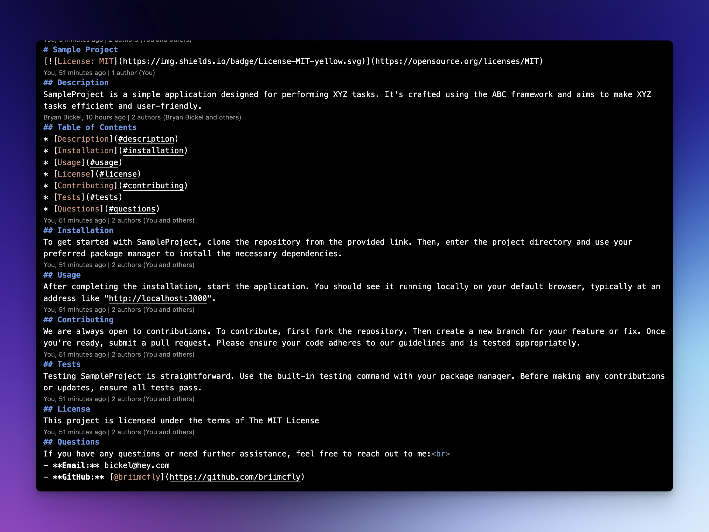

# Readme Generator

## User Story 
`AS A` developer  
`I WANT` a README generator  
`SO THAT` I can quickly create a professional README for a new project  

## Acceptance Criteria 
`GIVEN` a command-line application that accepts user input  
`WHEN` I am prompted for information about my application repository  
`THEN` a high-quality, professional README.md is generated with the title of my project and sections entitled Description, Table of Contents, Installation, Usage, License, Contributing, Tests, and Questions  
`WHEN` I enter my project title  
`THEN` this is displayed as the title of the README  
`WHEN` I enter a description, installation instructions, usage information, contribution guidelines, and test instructions  
`THEN` this information is added to the sections of the README entitled Description, Installation, Usage, Contributing, and Tests  
`WHEN` I choose a license for my application from a list of options  
`THEN` a badge for that license is added near the top of the README and a notice is added to the section of the README entitled License that explains which license the application is covered under  
`WHEN` I enter my GitHub username  
`THEN` this is added to the section of the README entitled Questions, with a link to my GitHub profile  
`WHEN` I enter my email address  
`THEN` this is added to the section of the README entitled Questions, with instructions on how to reach me with additional questions  
`WHEN` I click on the links in the Table of Contents  
`THEN` I am taken to the corresponding section of the README  

## Overview 
The goal of this project is to create a Readme Generator that runs in the command line that dynamically generates a README.md file from the user's input. This project utilizes the Inquirer package. 

## Installation
To get started with the readme generator, clone the repository from the provided link. Then, enter the project directory and use your preferred package manager to install the necessary dependencies.

## Usage
After completing the installation, start the application and follow the prompts

## Technologies Used
* npm
* inquirer package
* prompt

## Reflection 
This project has allowed me to apply the core skills I have recently learned and put them into practice. During development, I had the opportunity to deepen my understanding of the npm. Additionally, I developed a deeper appreciation for for the importance code commenting, and the development principal DRY. (Don't repeat yourself). In the future, I would like to spend more time giving users more control in the type of information they want to add to the readme. i.e. code blocks, lists, etc. 

## Questions
If you have any questions or need further assistance, feel free to reach out to me: 
- **Email:** bickel@hey.com
- **GitHub:** [@briimcfly](https://github.com/briimcfly)

